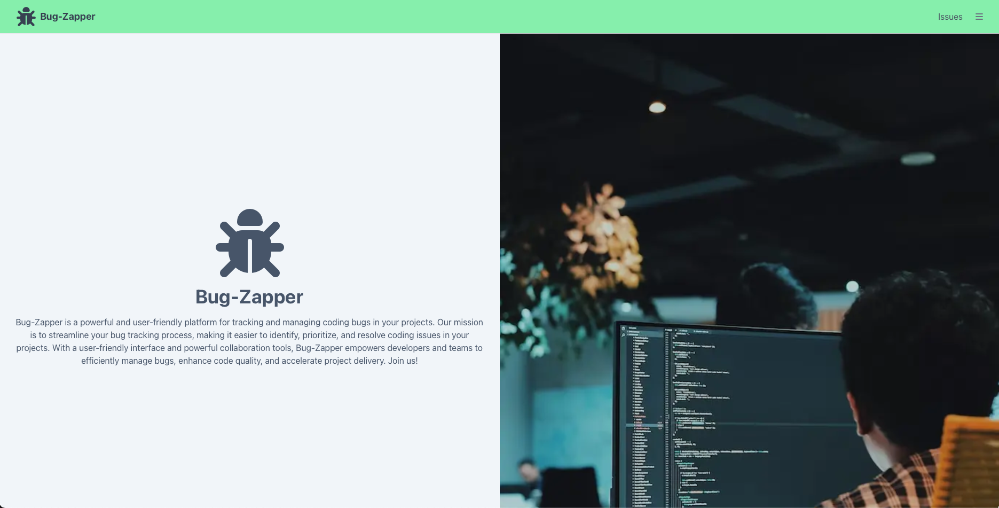
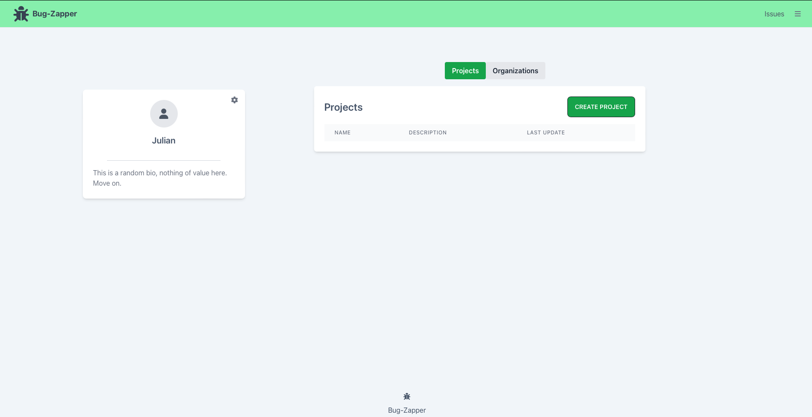
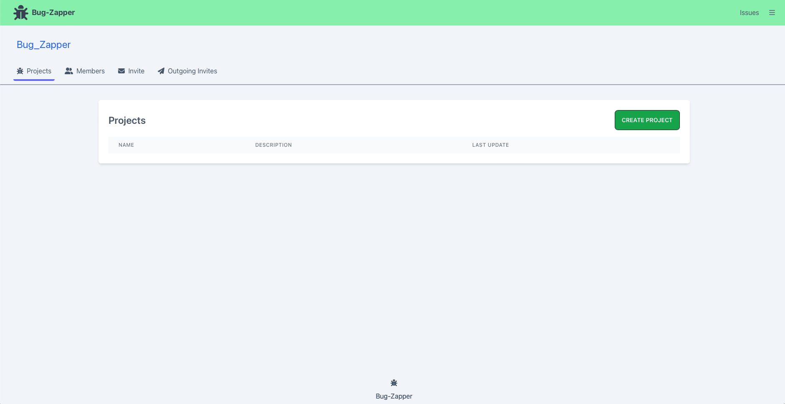
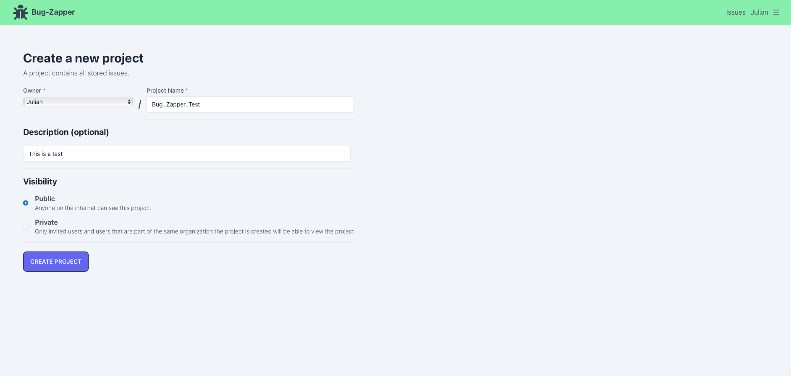

# Issue-Tracker

Inspired by GitHub, Issue-Tracker is an open-sourced project designed to help teams track and manage issues for their software. Users can create projects to help manage and track their issues, as well as invite other users to join and contribute issues to their projects. Users can also create organizations to help manage their team members and projects to keep everything in one place. The front-end is designed with ease of use in mind so users and teams can easily search and manage issues in a fast, efficient, and organized manner.

#### Note: The project is still in active development! Check the [Future Development](#future-development) section to see future plans.

## Quick Links

- [Issue-Tracker](#issue-tracker)
  - [Quick Links](#quick-links)
  - [Tech Stack](#tech-stack)
  - [Getting Started](#getting-started)
  - [Quick Technicals](#quick-technicals)
  - [Future Development](#future-development)
  - [Media](#media)
      - [Home Page](#home-page)
      - [User Page](#user-page)
      - [Organization Page](#organization-page)
      - [Create Project Page](#create-project-page)

## Tech Stack

- NextJS for our frontend and backend
- React (served from NextJS)
- NextAuth
- TailwindCSS
- PrismaDB
- Postgres

## Getting Started

1. Download or clone the project (https://github.com/Yzma/Issue-Tracker)
2. Navigate into the project directory and install all dependencies by running the `npm install` command in your terminal
3. Copy the .env.example file to .env.development and fill in the necessary PostgreSQL configuration
4. Run the command `npm run dev`. This will start running our NextJS server
5. Once the command finishes executing, the terminal should give you a link to view in the browser, it should be (http://localhost:3000) by default

## Quick Technicals

1. Users and Organizations share the same "Namespace", which is the '/' after the URL (ex. https://issue-tracker.com/NAMESPACE-HERE). This means that Users and Organizations cannot have the same name. This is by design.

## Future Development

The project itself right now is stable enough to be used in production (with a couple of frontend bugs), but there's still so much that I want to accomplish before I'm satisfied with the project. Below you'll find a list of things that I want to do in the near future:

1. Cleanup (This is a big one)

- Frontend (UI in general, as well as making components reusable)
- Backend (switch to tRPC to help manage backend code so we stop doing the exact same work each route)

2. Redis Implementation
3. Implement a way to assign users issues
4. Add a milestone system
5. Add more permissions with User Roles
6. Add a notifications system
7. General optimizations

## Media

#### Home Page

#### User Page

#### Organization Page

#### Create Project Page

## Authors
[Andrew Caruso](https://github.com/Yzma)\
[Julian Paredes](https://github.com/jpared3s)
